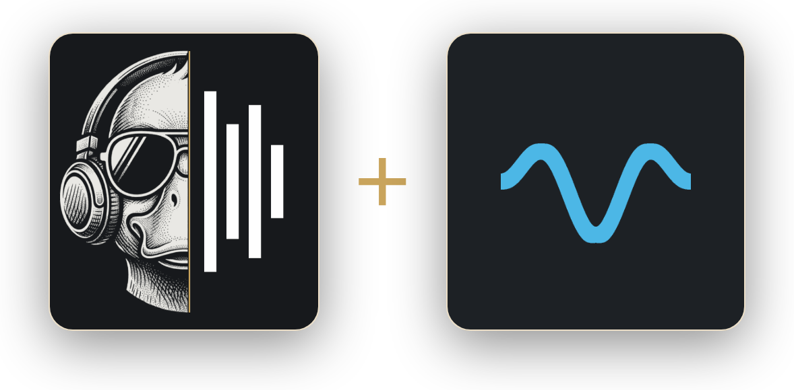

<div align="center">



<sub>Rouen + <a href="https://github.com/statelycurmudgeon/hqpweb">hqpweb</a> (logo © statelycurmudgeon, MIT)</sub>

</div>

# Rouen + HQPWeb — v1.9.1

**📖 Install guide & command builder: [meltface-80.github.io/MusicD-Remote](https://meltface-80.github.io/MusicD-Remote/)**

Rouen is a feature-rich music discovery companion for Roon, helping you rediscover your library through album browsing in a random order, a shelf of covers to flick through like the racks of a record shop, rich metadata, beautiful wall displays and seamless playback with Roon Server at the heart.

**+ HQPWeb.** For a Roon that plays through HQPlayer, Rouen has **[hqpweb](https://github.com/statelycurmudgeon/hqpweb)** built in — **statelycurmudgeon**'s web controller for HQPlayer: its filters, modulator or dither and presets, every change checked and undone if it stops playback, and a guide to where to start. It is statelycurmudgeon's hard work, carried here with thanks under hqpweb's MIT licence. See **[Rouen + HQPWeb](#rouen--hqpweb--hqplayer-control)** below for what it does, how to use it in Rouen, and how to run hqpweb on its own.

*Why Rouen?* It is a Roon extension, and a Rouen is a breed of duck — MusicD is short for Music Duck. It was called MusicD Remote until v1.8.74; the install commands, the image and the data volume keep their `musicd-remote` names, so nothing about an existing install changes.

---

## Rouen + HQPWeb — HQPlayer control

For a Roon that plays through [HQPlayer](https://signalyst.com/), Rouen has **[hqpweb](https://github.com/statelycurmudgeon/hqpweb)** built in — the web controller for HQPlayer by **statelycurmudgeon**. Rouen's HQPlayer screen is statelycurmudgeon's work: how HQPlayer is talked to, every change checked and undone when it stops playback, the filter guide (the ratings in it are Signalyst's own), the modulator and dither guide and the sources behind it, Find your DAC, presets, and finding and keeping several HQPlayers. Rouen carries it with thanks, under hqpweb's MIT licence, in Rouen's own look.

**hqpweb's repository: [github.com/statelycurmudgeon/hqpweb](https://github.com/statelycurmudgeon/hqpweb)** — its own README, changelog and releases, and the place to report anything about the HQPlayer side.

Neither hqpweb nor Rouen plays music: both talk to HQPlayer through HQPlayer's published control protocol (TCP port 4321), and Roon sends HQPlayer the music.

> Not affiliated with, endorsed by, or supported by Signalyst. HQPlayer is a trademark of its owner, used here only to identify compatible software.

### What it does in Rouen

* **Filters and the modulator** — HQPlayer's **1x filter** (sources below 50 kHz), **Nx filter** (higher rates), and **modulator** (SDM/DSD output) or **dither** (PCM), each chosen from HQPlayer's own list, with Signalyst's star ratings, what each filter favours, and which filters are apodizing
* **Every change is checked** — HQPlayer answers "OK" to settings it then ignores, so each change is read back. If one stops playback or HQPlayer can't keep up, the old settings are put back by themselves and the combination is remembered, so the lists warn about it next time. **Undo** is one tap
* **Warnings before you pick** — choices HQPlayer's own rules say won't play (an AHM modulator below DSD1024, a filter that can't do the conversion at a fixed rate), ones that failed on your machine before, and ones outside the manual's advice. It warns rather than blocks, with one exception: an AHM modulator below DSD1024 is offered together with a rate it can play at, and refused if HQPlayer offers no such rate
* **A guide for the modulator and dither (beta)** — a few questions about your DAC, amplifier, volume and connection, then where to start: a rate and modulator together, or the dither for your DAC, each linked to the post it comes from. **Find your DAC** looks up the chip in your DAC and the advice for it
* **Presets** — the current settings saved by name, applied in one tap
* **Live readouts** — the output rate and mode, the source, whether HQPlayer is keeping up (its processing speed), its apodization and clip counters, and the Roon zone playing through it
* **Several HQPlayers** — one per room, say: found on your network or added by address, with a picker at the top of the screen — *new in v1.8.85*
* **Several DACs behind one HQPlayer** — for an HQPlayer that plays to more than one DAC, with a saved HQPlayer profile for each: name them and choose the one in use, and the guide's answers, the settings learned not to work and that DAC's own presets follow your choice. This one began in Rouen, and hqpweb has since taken up the same model — *new in v1.8.85*

Left to Roon and Rouen, on purpose: the **volume** (Rouen's own volume control for the zone is the one to use — a preset never raises HQPlayer's volume more than 6 dB in one step, the automatic undo never raises it at all, and Undo returns to a louder level only if nobody has moved the volume since), **play, pause, skip and seek** (Roon's), and setting the **output rate and mode** by hand (the guide's rate-and-modulator pairs and its **Switch to PCM** are the ways in).

### Using it in Rouen

You need HQPlayer with control from the network allowed, on a computer the Rouen server can reach on TCP 4321. hqpweb has been tested with HQPlayer Desktop 5 and HQPlayer 6 Embedded; Desktop 6 and Windows are untested.

1. Open **☰ → Settings → HQPlayer** and switch on **HQPlayer control**. It is off by default, and while it is off nothing connects to anything.
2. Under **Your HQPlayers**, tap **Find HQPlayers** and **Add** the one you want — or type its address under **Add by address** (the control port is 4321 unless you changed it), tap **Test**, then **Add**. Find uses multicast, so it sees HQPlayers on the same network as the Rouen server, and only when Rouen runs with `--network host` (the standard Docker install does). On macOS with Docker Desktop, on Unraid's `br0`, or for an HQPlayer on another network or VLAN, add it by its address.
3. Open **☰ → HQPlayer**. Tap **1x filter**, **Nx filter** or **Modulator** (**Dither** in PCM) to choose; a ✓ marks the setting HQPlayer reports is running. **Presets** saves the current settings and applies saved ones.
4. For the guide, answer **Your setup** under **Settings → HQPlayer**, or the questions in the Modulator sheet's **Guide**. **Find your DAC** is under the PCM question in Settings → HQPlayer → Your setup.
5. **More than one HQPlayer?** Add each one, and switch between them with the **HQPlayer** picker at the top of the HQPlayer screen (or **Use** in Settings).
6. **More than one DAC behind one HQPlayer?** Under **Settings → HQPlayer → DACs**, type a name and tap **Add a DAC** (the first time, it also asks what the DAC in use now is called). Whenever you switch DACs in HQPlayer itself, choose the same one with the **DAC** picker on the HQPlayer screen — HQPlayer can't tell another app which DAC it is using. With more than one DAC, a new preset is kept for the DAC in use ("this DAC only"); **Edit** in the Presets sheet switches it to all DACs.
7. A combination that stopped playback is remembered under **Settings that didn't work**; **Forget** clears the list.

**Switching HQPlayer's profiles or output device** can't be done from Rouen or hqpweb: HQPlayer's control protocol doesn't let other apps do it. Use HQPlayer's own Client, or HQPlayer Embedded's web page, to change those (as hqpweb's README explains).

**No login.** Neither Rouen nor hqpweb has one: anyone who can reach them can change HQPlayer, just as anyone who can reach port 4321 already can. Keep them on a network you trust, and never expose them to the internet.

### Using hqpweb on its own

hqpweb also runs by itself, without Rouen, as a page of its own on port 4380: everything above (named DACs arrive in its next release), plus what Rouen leaves to Roon — HQPlayer's own volume, the output rate and mode, convolution, matrix profile, polarity, the 20 kHz filter, adaptive volume, and seeking in files HQPlayer plays itself — and, optionally, its own link to Roon. hqpweb is in beta. These steps are from **[hqpweb's README](https://github.com/statelycurmudgeon/hqpweb#install)** (0.1.0-beta.3), which is always the current version.

You need **Docker** on a machine that can reach HQPlayer on TCP 4321. The image runs on amd64 and arm64 (a Raspberry Pi 4/5, an ARM NAS, Apple Silicon).

**With Docker Compose** (hqpweb recommends it): save this as `docker-compose.yml` in a new folder, then run `docker compose up -d` there.

```yaml
name: hqpweb
services:
  controller:
    image: ghcr.io/statelycurmudgeon/hqpweb:latest
    container_name: hqpweb
    restart: unless-stopped
    init: true
    ports:
      - "4380:4380"
    volumes:
      - config:/config # your instances, presets and settings
volumes:
  config:
```

Update with `docker compose pull && docker compose up -d`.

**With `docker run`** (for Synology, Unraid or Portainer, say):

```sh
docker run -d --name hqpweb --restart unless-stopped --init \
  -p 4380:4380 -v hqpweb_config:/config \
  ghcr.io/statelycurmudgeon/hqpweb:latest
```

Update with `docker pull ghcr.io/statelycurmudgeon/hqpweb:latest`, then `docker rm -f hqpweb` and the same `docker run` again; settings live in the `hqpweb_config` volume, so they are kept.

**Then:** open `http://<that machine's IP>:4380` and go to **Settings → General → Add** to add your HQPlayer's address (leave the name blank to use HQPlayer's own). On a phone, "Add to Home Screen" makes it a full-screen app. Before updating, skim hqpweb's [CHANGELOG](https://github.com/statelycurmudgeon/hqpweb/blob/main/CHANGELOG.md); **Settings → About** shows the version you're running.

* **Finding HQPlayers** ("Scan now") uses multicast, so it needs host networking (Linux only) and only sees the same network segment — hqpweb's README shows the `docker-compose.override.yml` that turns it on. Otherwise add HQPlayers by address
* **Roon (optional):** in hqpweb's **Settings → Roon**, switch it on and **Find** the Core (or enter its address, port 9330); in Roon's **Settings → Extensions**, enable hqpweb; then back in **Settings → Roon**, pick the Roon zone that feeds each HQPlayer. hqpweb's container must reach the Core on TCP 9330, and each install of hqpweb needs its own approval in Roon
* **Options** — the image version to stay on (`HQPWEB_TAG`), the port, the interface it listens on, and the host names allowed behind a reverse proxy — are in hqpweb's README under [Options](https://github.com/statelycurmudgeon/hqpweb#options)

Rouen uses port 3399 and hqpweb port 4380, so the two don't collide on one machine.

---

## Features

Every feature below has an **ⓘ** — tap it for how to switch the feature on, set it up and use it.

📚 Shelf — *new in v1.9.1*

Flick through your collection the way you once flicked through a rack of CDs or records — made for a tablet on a stand or a TV.

* **A shelf of covers that turns under your finger.** A short swipe moves one album; swipe and hold keeps it turning, faster the further out you hold; a hard flick spins it, and it lands on an album three seconds later. Tap a cover at the side to bring it to the front — tap the front cover and the case turns over to show its tracks
* **Three looks:** **Covers** on a glossy shelf, **Spines** — a CD rack, each spine in its own cover's colour, with a letter tab where each letter starts — and **Carousel**, a ring of covers seen from a little above
* **Choose what is on it:** **Genres** (Roon's own, each with how many albums it gives), **Artists** by letter (A–Z, # and 1–9) and **Random**. Tap to choose and tap again to undo; a chosen tile has a brass outline, and **Clear all ×** clears a section. With nothing chosen the shelf is the whole library, A → Z by artist
* **Random** puts the shelf in a random order, as the Random albums screen does — only the genres and letters you chose, if any
* **Play now, Play next, Add to queue** under the front cover, to the zone shown at the bottom — tap it to choose another. Shelf opens on the record that is playing
* **‹ Remote** top left and **Wall Display ›** top right; the wall display has a **Shelf ›** button of its own

<details><summary><b>ⓘ</b> How to set it up and use it</summary>

Nothing to switch on. Open **☰ → Shelf**, tap **Shelf ›** on the wall display, or point a browser at `http://<server-ip>:3399/shelf`. Pick a look with the three buttons above the shelf (each device remembers its own); **Spin** does what a flick does, and a mouse wheel, a trackpad and the arrow keys turn the shelf too. **Wall Display ›** shows while the wall display is switched on in **Settings → Wall Display**, and a device with a screensaver time set there (**This device → Switch to the wall display**) goes from Shelf to the wall display after that long untouched.

</details>

⸻

🎚️ HQPlayer control, from hqpweb — *new in v1.8.78; several HQPlayers and DACs in v1.8.85*

statelycurmudgeon's **[hqpweb](https://github.com/statelycurmudgeon/hqpweb)**, built in: HQPlayer's filters, modulator or dither and presets from a screen in the side menu, every change checked and undone if it stops playback, and a guide to where to start.

* **1x and Nx filters, modulator or dither, presets** — chosen from HQPlayer's own lists, with Signalyst's ratings
* **A safety net** — each change is read back; one that stops playback or that HQPlayer can't keep up with is put back by itself and remembered
* **A guide for the modulator and dither** (beta), and **Find your DAC**
* **Several HQPlayers**, found on your network or added by address, and **several DACs behind one HQPlayer**

<details><summary><b>ⓘ</b> How to set it up and use it</summary>

Switch on **☰ → Settings → HQPlayer → HQPlayer control**, then **Find HQPlayers** and **Add** yours (or add it by address; the control port is 4321). Open **☰ → HQPlayer**. The full instructions are under [Rouen + HQPWeb](#rouen--hqpweb--hqplayer-control).

</details>

⸻

💾 Backup & restore — *new in v1.8.84*

Keep a copy of what you have set up, and put it back in one tap.

* **Choose what goes in:** Settings, Playlists & Dynamic Playlists, Listen later, and API keys & sign-ins — any of the four
* **Kept on the server** on the data volume: your last 10, plus the last 5 "Before restore" copies, counted apart. Each can be downloaded — on an installed iPhone or iPad app, through the share sheet's **Save to Files**
* **Restore** replaces what you chose with what the backup holds, after keeping a "Before restore" copy of how things were. The server restarts, and the page reloads by itself when it is back
* **Restore from a file** you downloaded earlier
* Never in a backup: play history, the library, the Roon pairing, and each device's own look

<details><summary><b>ⓘ</b> How to set it up and use it</summary>

Open **☰ → Settings → Backup & restore**. Switch on the parts you want (the choice is remembered on that device) and tap **Back up now**. Each backup in the list has **Restore**, **Download** and **Delete**; **Restore from a file…** takes one you downloaded. A backup with your API keys in it holds your sign-ins, so keep a downloaded copy somewhere private.

</details>

⸻

⏭️ Play next, everywhere — *new in v1.8.80*

* **Play now, Play next, Queue** on every track in the album view
* **Play next** in the selection menu, for selected tracks and selected albums alike, and in the album's **⋯** menu
* What you choose plays straight after the current track, with the rest of the queue after it — selected **tracks in album order**, selected **albums in the order you picked them**

<details><summary><b>ⓘ</b> How to set it up and use it</summary>

Nothing to set up. In an album, tap a track for its buttons and choose **Play next** — or long-press tracks or albums to select several (the one you pressed is already picked) and choose **Play next** from the selection menu.

</details>

⸻

📱 The album view and mini player, sized for the screen — *new in v1.8.81*

* **Tablets and desktops:** *About this album* sits under the cover, beside the tracks; on a tablet the album view fills the screen
* **The mini player on touch screens** is taller, with a bigger cover and buttons
* **On a desktop** the mini player is a card in the bottom-right corner, and it can be **dragged anywhere** — this browser remembers where
* A **⋯** menu with no room below opens upwards

<details><summary><b>ⓘ</b> How to set it up and use it</summary>

Nothing to set up. On a desktop, press anywhere on the mini player except a button and drag it; double-click it to send it back to its corner.

</details>

⸻

🌙 Now playing, the whole cover — *new in v1.8.79*

* **Now playing shows the whole cover**, framed, in the space the controls leave — no longer cropped edge to edge
* **The seek bar is a brass level meter** where a track has no waveform
* **A long press picks what it is on** — on an album tile or a track, it starts selecting with that one already picked
* **The theme** is chosen in UI Settings, on the same page as *Show sample rate on artwork*

<details><summary><b>ⓘ</b> How to set it up and use it</summary>

Nothing to set up. Choose a theme under **☰ → Settings → Setup → UI Settings → Theme** and tap **Apply** — it is remembered on that device.

</details>

⸻

🎛️ UI Settings, and searching your labels — *new in v1.8.77*

Make the app fit the screen it is on, and find a label without scrolling for it.

* **Text size** for album and artist names, and for the title at the top of a grid screen — Normal, +10%, +25% or +50%
* **Grid layout** for album, playlist and label grids — Auto, 3 columns, 2 columns or List
* **Tile size** for album and label tiles on every screen, −50% to +50%. In Auto, bigger tiles mean fewer columns
* **Labels search and order** — a search glass in the Labels screen's top-right corner, and a `#–Z` / `Z–#` button beside it
* **Home Screen rows drag smoothly** into place and stay there when you let go
* **Smart Picks open somewhere:** an album in your library opens its album view; one that is not opens on your default streaming service (the one set in Share Card)
* **Clearer titles:** the random wall is titled "Random albums", and an artist's page shows "2 albums · Artist" beside Back

<details><summary><b>ⓘ</b> How to set it up and use it</summary>

Open **☰ → Settings → Setup → UI Settings** and pick a size or layout from each list; the change shows at once and is saved on that device only, so a phone and a wall-mounted tablet can differ. **Grid layout → List** shows every grid screen as a list. On the **Labels** screen, tap the magnifying glass to search (the × clears the text, then closes the bar) and the `#–Z` button to reverse the order. To reorder the Home screen, go to **Settings → Setup → Home Screen** and drag a row by its handle.

</details>

⸻

🐳 A ready-made image — *new in v1.8.71*

Install with one `docker run` — nothing to download or build — and keep updating with one tap in the app.

* **ghcr.io/meltface-80/musicd-remote**, built for x86 and 64-bit ARM: PCs and NAS boxes, a Raspberry Pi 4 or 5 on a 64-bit OS, Apple Silicon Macs
* **One-tap updates, as before** — the banner's **Update** button installs the new release in place and restarts in a few seconds
* **Switching needs no reinstall** — remove the old container, run the image with the same volume, and your Roon pairing, history and settings carry over

<details><summary><b>ⓘ</b> How to set it up and use it</summary>

Run the command under [Install (Docker)](#install-docker), or build it for your setup with the [install configurator](https://meltface-80.github.io/MusicD-Remote/#install). Then, in Roon, go to **Settings → Extensions** and click **Enable** on **Rouen**, and open `http://<server-ip>:3399` on any phone, tablet or computer. On a phone, add it to your home screen so it opens like an app. The image and volume keep their `musicd-remote` names, so existing installs carry on unchanged.

</details>

⸻

🔄 Your Roon library, followed in seconds — *new in v1.8.68*

Add albums in Roon and they are in the app within about a minute, with no rescan.

* While the app or the wall display is open it checks Roon every 30 seconds (every 3 minutes when nobody is looking), with three tiny calls that cost the Core almost nothing
* A change is followed until Roon settles, then the library is read once — a big import costs one pass, not one per album
* An album opened while a change is still settling fixes itself as soon as the new library lands
* The side menu says when the library was last checked — "12,963 albums · checked just now"

<details><summary><b>ⓘ</b> How to set it up and use it</summary>

Nothing to switch on — it runs whenever the extension is paired with Roon. To force a fresh read at any time, open the side menu (☰) and tap the **Rescan library** line at the bottom, which also shows the album count and when Roon was last checked.

</details>

⸻

🧭 Simpler navigation, and Settings grouped — *new in v1.8.83*

* **The ☰ menu button is Home's.** On every other screen the brass **‹** takes its place: from an artist page, it goes back to the album or screen you came from; from a label you opened from an album, back to that album; anywhere else, Home
* **A shorter side menu:** Pitchfork, Labels, Qobuz, Tidal, Listen later, Discover, Dynamic Playlists, Playlists, Wall display, Shelf (since v1.9.1), HQPlayer, then Rescan library and Settings. **Random albums** and **Smart Picks** open from their Home rows — switch a row off and its menu entry comes back — and **Import** is at the top of the Playlists screen
* **Settings, grouped:** Services, Playback, Wall Display, HQPlayer, **Setup** and Updates (with Backup & restore beside them since v1.8.84). **Setup** holds the app's own preferences — Smart Picks, Record labels, Home Screen, UI Settings, Share Card, Discover and API Keys — and Back from any of them returns to Setup
* **A compact list** (since v1.8.69): on a phone every Settings page opens full screen, with its title and back arrow pinned at the top while a long page scrolls; on a tablet or desktop the list is a side panel and each page is as wide as its content

<details><summary><b>ⓘ</b> How to set it up and use it</summary>

Open the side menu (☰, top left on Home) and choose **Settings** at the bottom. Tap a row to open its page; the back arrow returns one level and **×** closes Settings. Settings marked with **ⓘ** explain themselves when you tap the ⓘ.

</details>

⸻

🕒 Listen later — *new in v1.8.67*

Put an album aside to play another time. Roon's own Listen later cannot be reached from an extension, so this is Rouen's own list — kept on the server, the same on every device, and safe across a library rescan.

* **Put albums aside** from an album's ⋯ menu, from a selection of albums on any wall, or with **＋ Listen later** on a Smart Pick
* **A Home row** of everything put aside, newest first. Tap its title for the full list
* **Albums you own play** straight from the list. A Smart Pick not in your library yet can be **added to your library** in one tap, or **opened in Qobuz or TIDAL** to hear it first
* **It tidies itself.** An album comes off the list once every track has been played through since you put it aside — on any zone, from any app — or whenever you tap Remove
* **Smart Picks can go here instead of your library** (see Smart Picks)

<details><summary><b>ⓘ</b> How to set it up and use it</summary>

Open any album and choose **Listen later** from its **⋯** menu — or long-press albums on a wall to select several and choose **Listen later**, or tap **＋ Listen later** on a Smart Pick. Find the list under **☰ → Listen later**, or on its Home row; switch the row on or off and move it under **Settings → Setup → Home Screen**. To have each day's Smart Picks land here, set **Settings → Setup → Smart Picks → Send each day's picks to → Listen later**.

</details>

⸻

↔️ Previous / next album — *new in v1.8.66*

Step from album to album without leaving the album view.

* **Swipe** the album card sideways, tap the **chevrons** on the cover's edges, or use the **arrow keys**
* Previous and next are the albums either side of the one you opened, on the screen you opened it from — a Home row, the Library wall, an artist or label page
* Close the card and you land on the album you stepped to

<details><summary><b>ⓘ</b> How to set it up and use it</summary>

Nothing to set up. Open an album from any row or wall, then swipe the card left or right, tap **‹ ›** on the edges of the cover, or press **←** / **→** on a keyboard. An album opened from search or Now playing has no neighbours, so the chevrons don't show.

</details>

⸻

📺 Remote ⇄ wall display, and a screensaver — *new in v1.8.66; the Remote button always there since v1.8.87*

* **☰ → Wall display** turns the remote into the wall display for its zone, and **‹ Remote** in the display's top-left corner brings the remote back exactly as you left it
* **‹ Remote is always on screen**, faint, and takes one tap — off-white over a dark screen, grey over a light artist photo. **Shelf ›** sits opposite it, top right
* **A screensaver timer** — switch to the wall display after 1 to 60 minutes untouched. Set per device and off unless you choose it
* It never interrupts: it waits while Settings, a sheet or a selection is open

<details><summary><b>ⓘ</b> How to set it up and use it</summary>

First switch on **Settings → Wall Display → Wall display** — the menu entry and the screensaver only appear while it is on. Then open **☰ → Wall display**. For the screensaver, on the device you want it on, choose a time under **Settings → Wall Display → This device → Switch to the wall display**. On the display, tap **‹ Remote** to go back, or anywhere else to reveal the mode buttons.

</details>

⸻

📡 Live screens — *new in v1.8.65*

Every screen keeps itself up to date — you never have to leave a screen and come back to see a change.

* Home, the Library and Not played walls, the Queue, the album, artist and label pages, Smart Picks and Discover all refresh themselves when something changes: a play, a release date found, a setting changed on another device
* **In place** — your scroll position is kept, nothing flashes "Loading…", and albums that did not change stay exactly where they are
* **Nothing moves under your finger** — a change waits while you are pressing, scrolling or selecting

<details><summary><b>ⓘ</b> How to set it up and use it</summary>

Nothing to switch on. Every open device checks the server every few seconds while it is on screen and redraws only what changed — so an album played on one phone leaves **Album of the day** on every other device too.

</details>

⸻

🧭 Discover — *new in v1.8.37*

New records by the artists you actually listen to.

* **Read from your play history, not your library**, ranked by how many separate DAYS you played an act — forty plays in one night is an evening, eight plays on eight days is a habit
* **Albums only**, from the last two months, and never a record you already have
* **A reissue is not a new record.** A remaster is only refused when the title says so AND the act has an older release under the same name
* **Every row goes somewhere.** In your Roon library it queues; otherwise it opens in your default streaming service
* Uses Deezer's public catalogue only, and never touches your Roon Core

<details><summary><b>ⓘ</b> How to set it up and use it</summary>

Switch on **Settings → Setup → Discover → Discover** (off by default) and pick the hour under **Look for new records at** (server time). It looks once a day; **Refresh** on the same page runs it straight away. Then open **☰ → Discover**. It needs some play history to work from — the more you listen through Roon, the better it gets. Your default streaming service is set under **Settings → Setup → Share Card → Default**.

</details>

⸻

〰️ Waveform — *rebuilt for accuracy in v1.8.24; Qobuz and TIDAL since v1.8.20, reworked in v1.8.51–56*

* The seek bar on Now playing and the wall display's progress strip draw the shape of the track you are listening to — where the quiet intro ends, where the loud middle is
* **Each bar is the level of its slice of the track**, measured from both channels at full rate, so a modern master draws as a record rather than a brick
* **The shape sits under the playhead**, at every point in the track
* Each track is analysed once and stored; the next track in the queue is prepared while the current one plays
* **Local files, and Qobuz and TIDAL streams.** Roon streams those services straight to your endpoint and never to an extension, so the track is fetched from the service with your own account, turned into 4,000 loudness values and discarded — no audio is kept, and Roon still handles all playback
* Anything the app cannot identify confidently simply keeps the plain progress bar
* [How this works, in detail](STREAMING-WAVEFORMS.md)

<details><summary><b>ⓘ</b> How to set it up and use it</summary>

Switch on **Settings → Playback → Waveform** (off by default). Local files need your music mounted at `/music` in the install command. Qobuz and TIDAL tracks need that service connected under **Settings → Services**. Play something and open Now playing (tap the mini player); the first play of a track takes a second or two to analyse.

</details>

⸻

🎵 Album Discovery

* Browse your music library in a fresh and engaging way, and rediscover forgotten favourites
* **Random albums** — a screen of random albums, with a filter
* **Album of the day** — one album, the same on every device, from 00:01 until it is played (anywhere); a new one at the next 00:01
* **Random Album** — one tap plays an album you haven't played in 12 months; its disc turns slowly all the time and spins up while it chooses
* **Not played in 6 months** — recommendations that start once the extension has six months of your listening behind it
* **Label of the week** (with Record labels switched on)
* **Random album radio** — keeps whole albums coming when the queue ends

Over time the database learns when you last listened to an album and offers up others instead, so you rediscover forgotten albums.

<details><summary><b>ⓘ</b> How to set it up and use it</summary>

All of these live on **Home**. Under the greeting, with no heading, are the **Random Album** disc — tap it to play — and **Album of the day** (marked ★ Today). The **Not played in 6 months** row stays hidden until there are six months of your listening to work from, then appears by itself (unless you switch it off). Choose which rows show, and their order, under **Settings → Setup → Home Screen**. The **Random albums** heading on Home opens a full screen of random albums; the shuffle button draws again and **Filter** narrows it by genre, tag or decade. Set `TZ` in your install command so Album of the day turns at *your* 00:01, not UTC's.

</details>

⸻

📚 Rich Library Browsing

* Your whole library — the **Library** row on Home opens a full grid that scrolls through every album, with **Sort** (album, artist, release date, plays, last played, random), **Focus** (decade, genre, source, listening history), shown as a grid or a list as set in **Settings → Setup → UI Settings**
* Artists, genres, record labels, decades and tags
* **Dynamic Playlists** built from a Library Focus, **Playlists** (your Roon playlists, read-only, and Rouen's own) and importing a playlist (**Import**, on the Playlists screen)
* Tap an artist's name in an album to see all their albums; the brass **‹** at the top left takes you back to the album you came from

Album artwork is cached on the server as your library syncs, so browsing stays fast and puts no extra load on your Roon Core — even with a large collection.

<details><summary><b>ⓘ</b> How to set it up and use it</summary>

Tap the **Library** title on Home for the full wall, then use **Sort** and **Focus** at the top; the arrow flips the order. Dynamic Playlists and Playlists are in the side menu (☰), and **Import** at the top of the Playlists screen brings a playlist in. In an album, tap the artist's name for their page, and the brass **‹** at the top left to go back.

</details>

⸻

🔍 Powerful Search

* Search your library by album, artist and record label
* When Qobuz or TIDAL is connected, their catalogue results are added below — and Pitchfork reviews too
* Browse Qobuz and TIDAL directly and add favourites to your Roon library

<details><summary><b>ⓘ</b> How to set it up and use it</summary>

Tap the magnifier at the top of Home and type. To include Qobuz or TIDAL, connect them under **Settings → Services**; they then also appear in the side menu for browsing.

</details>

⸻

💿 Detailed Album Pages

* High resolution artwork, edge to edge
* Track listing, with Play now / Queue per track and multi-select
* Release date, record label and the Pitchfork score (with a link to the review on pitchfork.com)
* A description of the record — Qobuz's or Wikipedia's
* Multiple artist support — each credited artist is its own link

<details><summary><b>ⓘ</b> How to set it up and use it</summary>

Tap any album. **Play now** and **Queue** are under the title, and **⋯** holds Next, Shuffle, Radio and Listen later. Tap a track for Play now / Queue, or long-press to select several. Tap an artist's name to see all their albums.

</details>

⸻

▶ Playback Integration

* Play or queue albums and individual tracks, and multi-select albums to queue several at once
* Now playing with seek, shuffle, repeat and volume
* Move the queue between zones, group zones, power devices, pause or mute every zone
* The Queue's "played earlier" list puts a past track back after the current one

<details><summary><b>ⓘ</b> How to set it up and use it</summary>

Pick your zone under **Settings → Playback → Zone / output** (per device), or with the speaker button on the mini player. Tap the mini player for Now playing; the device button there holds the zone tools. Long-press albums on any wall to multi-select.

</details>

⸻

📺 Full Screen Wall Display

Turn a TV or tablet into a now-playing display.

* Large album artwork and artist photography
* Album reviews and artist biographies
* "More from" the artist or label — grids you can tap to play or queue
* Playback progress, with the waveform when it is on
* Automatic rotation, or pin one mode: Auto, Art, Photos, Bio, Review, Library

<details><summary><b>ⓘ</b> How to set it up and use it</summary>

Switch on **Settings → Wall Display → Wall display** (off by default) and set **Rotate every**. Then point any browser at `http://<server-ip>:3399/display`, or choose **☰ → Wall display**. Artist photos need a FanArt.tv key (see below). Tap the screen for the mode buttons; **‹ Remote** and **Shelf ›** are always in the top corners.

</details>

⸻

🏷 Record Label Explorer

* Label of the week
* Label logos from Discogs and FanArt.tv
* Merge labels, and undo a merge
* Browse every release from a label
* Libraries filed in label folders can take the label from the folder

<details><summary><b>ⓘ</b> How to set it up and use it</summary>

Switch on **Settings → Setup → Record labels** — it is off by default, and nothing label-related runs until it is on. Add the optional Discogs and FanArt.tv keys (below) for logos. Then open **☰ → Labels**: long-press tiles and tap **Merge** to combine labels, tap **N merged** on a tile to undo, and use the logo button on a label to pick a logo. **Label from folder depth** on the same page is for libraries filed by label.

</details>

⸻

📻 Random Album Radio

When the current queue finishes, keeps whole random albums coming — avoiding recently played ones — indefinitely.

<details><summary><b>ⓘ</b> How to set it up and use it</summary>

Switch on **Settings → Playback → Random album radio** for the zone selected there. Roon Radio is the alternative on the same page; turning one on turns the other off for that zone.

</details>

⸻

⭐ Artist Discovery

* Artist biographies and portraits, validated against the artist's own albums (Qobuz, TIDAL or Wikipedia)
* Navigation between artists and albums — and back to the album you came from

<details><summary><b>ⓘ</b> How to set it up and use it</summary>

Tap an artist's name anywhere — in an album, on Now playing, or in search. The artist page lists their albums and the ones they appear on, with a bio above. The brass **‹** at the top left goes back.

</details>

⸻

🌐 Online Integrations

Information and artwork from Roon, Qobuz, TIDAL, Discogs, FanArt.tv, Pitchfork, MusicBrainz, iTunes, TheAudioDB, Bandcamp, Wikipedia, Deezer and ListenBrainz.

<details><summary><b>ⓘ</b> How to set it up and use it</summary>

Most need nothing from you. Qobuz and TIDAL are connected under **Settings → Services** (each signs in on the service's own page — no password is typed into the app). Discogs and FanArt.tv take a free key each under **Settings → Setup → API Keys** — see below.

</details>

⸻

📤 Share card — *rebuilt around the review in v1.8.58; smarter suggestions in v1.8.82*

Tap Share on any album or on Now playing and the record gets a card of its own, with somewhere to go underneath it.

* **The card** — album artwork, artist, title, the release date and record label, a description of the record, and the Pitchfork score with its Best New Music flag where there is one
* **Where to hear it** — Qobuz, TIDAL, Spotify, Apple Music, Amazon Music, Deezer and Bandcamp. Qobuz opens the Qobuz **app**
* **Where to read about it** — Wikipedia, Pitchfork and AllMusic for the album, and Wikipedia and AllMusic for the artist if you want them
* **"If you like this"** — three acts worth hearing next, weighed by what you play: two you haven't heard that sit near the acts you play most, and one you know with a record you don't own yet. Each names a record and says why ("Near Steely Dan and Boz Scaggs, which you play"), and sharing the same record again gives a different three. One in your Roon library is queued; one that is not opens in your default service
* **Rouen's logo** in the corner of the card

<details><summary><b>ⓘ</b> How to set it up and use it</summary>

Tap the share button in an album or on Now playing. Choose which services and review links appear, and the default service, under **Settings → Setup → Share Card**; holding a service button under the card also sets the default for that device.

</details>

⸻

🔄 Automatic Updates

* Checks GitHub for a new release at startup and every 7 days
* One-tap **Update**, installed in place

<details><summary><b>ⓘ</b> How to set it up and use it</summary>

When a release is out, a banner offers **Update** — tap it and the app reloads on the new version in a few seconds. **Settings → Updates → Check for updates** looks straight away. See [Updating](#updating).

</details>

⸻

🐳 Docker Support

* Docker image and Docker Compose
* Persistent configuration on a named volume
* Automatic migration of pairing information
* Simple upgrades

<details><summary><b>ⓘ</b> How to set it up and use it</summary>

See [Install (Docker)](#install-docker). Keep the `musicd-remote-data` volume name — it holds your pairing, history and settings.

</details>

⸻

⚡ Modern Interface

* Responsive — phone, tablet, desktop and TV
* A greeting and today's date at the top of Home, section titles in small brass capitals
* Two themes — **Graphite and Brass** (the default) and **Brass light** — both meeting the AA contrast standard
* Toasts appear above the mini player, never over it
* Every API key box shows a ✓ once the service has accepted the key

<details><summary><b>ⓘ</b> How to set it up and use it</summary>

Choose a theme under **Settings → Setup → UI Settings → Theme** and tap **Apply** — it is remembered per device. **Show sample rate on artwork** on the same page adds bit depth and sample rate to every tile.

</details>

---

## Setting up Discogs and FanArt.tv API keys

Both are free and optional. Discogs improves label names and logos; FanArt.tv supplies label logos and the wall display's artist photos.

### Discogs personal access token

1. Sign in (or register free) at [discogs.com](https://www.discogs.com)
2. Go to **Settings → Developers** → click **Generate new token**
3. Copy the token
4. In the app, open **☰ → Settings → Setup → API Keys** → paste into **Discogs token** → tap **Save**. A **✓** in the box means Discogs accepted it

### FanArt.tv API key

1. Register free at [fanart.tv](https://fanart.tv/get-an-api-key/#personal) for a personal API key
2. Log in or register, and follow the on-screen prompts (or come back to the link above afterwards)
3. Copy the key shown there
4. In the app, open **☰ → Settings → Setup → API Keys** → paste into **FanArt.tv key** → tap **Save**. A **✓** in the box means FanArt.tv accepted it

Label logos also need **Settings → Setup → Record labels** switched on.

---

> **Note on label accuracy** — an album may appear under a label that differs from the one shown in the album view. This could be correct: many albums could be released under multiple labels simultaneously (for example, Daughtry's *Baptized* was released under 19 Recordings, RCA, and Sony Music). The extension shows whichever label your file tags or the scan sources attribute to the album in the case of being a Qobuz or Tidal version.

---

## Install (Docker)

```bash
docker run -d \
  --name musicd-remote \
  --pull always \
  --restart unless-stopped \
  --network host \
  -e TZ=Europe/London \
  -v musicd-remote-data:/app/data \
  -v /your/path/to/Music:/music:ro \
  ghcr.io/meltface-80/musicd-remote:latest
```

**Only use Qobuz or TIDAL?** Leave out the `-v /your/path/to/Music:/music:ro` line. Nothing to download or build: the image is published for x86 (`amd64`) and 64-bit ARM (`arm64`) — PCs and NAS boxes, a Raspberry Pi 4 or 5 on a 64-bit OS. `--pull always` fetches the current release whenever this command runs, so re-creating the container can never quietly start an older copy left on the machine; it needs Docker 20.10 or later. If your user isn't in the `docker` group, put `sudo` in front.

> **The `musicd-remote-data` volume holds your Roon pairing, play history, and label cache — never rename it once created.** Point every future `docker run` at the same name and everything carries over; a different name makes Docker silently create a fresh empty volume (new pairing, lost history). **Upgrading from v1.6.31 or earlier?** Your data lives in the old `roon-random-albums-data` volume — move it once with the copy step in [Updating](#updating) below before using this command.

`--network host` is required so the extension can discover your Roon Core on the local network. The `-v musicd-remote-data` flag mounts a named Docker volume so that your Roon pairing, play history, and label cache survive container rebuilds. The `-v .../Music:/music:ro` flag mounts your music directory read-only so the extension can read label tags directly from your files — this is optional but gives the most accurate label data. Adjust the path to match your music library location.

Set `-e TZ=` to your own zone (`Europe/London`, `America/New_York`, …). A container runs on UTC otherwise, which changes when **Album of the day** turns over (00:01) and the hour **Smart Picks** and **Discover** run.

The optional **Discogs** and **FanArt.tv** keys can be supplied at install too, via `RRA_DISCOGS_KEY` and `RRA_FANART_KEY` — put them in a `.env` file next to the command and add `--env-file .env`, rather than inline with `-e`, which would leave them in your shell history and in `docker inspect`. They are first-run seeds only: a key saved in **Settings** always wins, and the [install configurator](https://meltface-80.github.io/MusicD-Remote/#install) writes the `.env` block for you. Qobuz and TIDAL cannot be set this way — both sign in through the service's own page after the container is running, so there is no password for the command to carry.

**More than one music folder?** The scan reads everything under `/music` recursively, so mount each one as its own subdirectory rather than adding a second root — `-v /mnt/nas/Albums:/music/Albums:ro -v /mnt/usb/Vinyl:/music/Vinyl:ro`. A mount at `/music2` would never be looked at. The [install configurator](https://meltface-80.github.io/MusicD-Remote/#install) builds the whole command for you. Note that **Label from folder depth** in Settings counts from `/music`, so with several folders every depth goes up by one.

You should see the extension appear in **Roon → Settings → Extensions** as **Rouen** (publisher MusicD). Click **Enable**, then browse to `http://<your-server-ip>:3399`.

### Install Docker

If Docker isn't installed yet:

```bash
# DietPi
sudo dietpi-software install 162

# Debian / Ubuntu
curl -sSL https://get.docker.com | sh
```

## Updating

**In the app — one tap.** When a new version is out, a banner offers **Update**: tap it and the extension downloads the release, swaps it in and restarts in a few seconds — the page reloads on its own. **Settings → Updates → Check for updates** looks straight away, and Roon's own Settings page for the extension offers the same.

**Or pull the image** — also the way to pick up changes to the image itself (Node, ffmpeg):

```bash
docker pull ghcr.io/meltface-80/musicd-remote:latest
docker stop musicd-remote && docker rm musicd-remote
# then the docker run command from Install — the data volume carries everything over
```

**Switching from a download-and-build install** (the `docker build` commands this README used to give)? Nothing to uninstall and nothing to re-pair: `docker stop musicd-remote && docker rm musicd-remote`, then the command from [Install](#install-docker) with the same volume name. Your Roon pairing, history and settings carry over. The old locally built images can go afterwards — `docker images musicd-remote` lists them, `docker image rm musicd-remote:<version>` removes one — along with the `/opt/musicd-remote` folder, which nothing uses any more.

**On v1.8.70's image?** That one build has no Update button, so it needs the pull above once; from v1.8.71 on, updates are one tap.

> **Coming from v1.6.31 or earlier (the Roon-Random-Albums days)?** Two one-time steps before the commands above:
>
> 1. **Stop and remove the old container name**: `sudo docker stop roon-random-albums && sudo docker rm roon-random-albums` (the old `/opt/roon-random-albums` folder can be deleted afterwards).
> 2. **Move your data to the new volume name** — your Roon pairing, play history, and label cache live in the old `roon-random-albums-data` volume; copy them once into `musicd-remote-data`:
>
> ```bash
> sudo docker run --rm \
>   -v roon-random-albums-data:/from \
>   -v musicd-remote-data:/to \
>   alpine sh -c "cp -a /from/. /to/"
> ```
>
> Skip step 2 and the new container starts with an empty volume: Roon asks you to authorize again and your history is gone. (Once you've confirmed everything carried over, the old volume can be removed with `sudo docker volume rm roon-random-albums-data`.)

## Migrating from a native install

If you're running an older native (non-Docker) install, the app shows a migration banner with copy-ready commands. To bring your Roon pairing, history and settings across as well, follow these steps instead:

```bash
# 1. Fetch the image first — if this fails, nothing has been stopped
docker pull ghcr.io/meltface-80/musicd-remote:latest

# 2. Stop the native service
sudo systemctl stop roon-random-albums
sudo systemctl disable roon-random-albums

# 3. Copy its data into the volume the container uses. A native install keeps
#    everything in data/ beside its code; use your own folder if it isn't here.
sudo docker run --rm \
  -v /opt/roon-random-albums/data:/from \
  -v musicd-remote-data:/to \
  alpine sh -c "cp -a /from/. /to/"

# 4. Run it
docker run -d \
  --name musicd-remote \
  --pull always \
  --restart unless-stopped \
  --network host \
  -e TZ=Europe/London \
  -v musicd-remote-data:/app/data \
  -v /your/path/to/Music:/music:ro \
  ghcr.io/meltface-80/musicd-remote:latest
```

Leave out the `/music` line if you only use Qobuz or TIDAL. Confirm the extension appears in **Roon → Settings → Extensions** before removing the old install.

### Cleaning up the old install

```bash
# Remove the service file
sudo rm /etc/systemd/system/roon-random-albums.service
sudo systemctl daemon-reload

# Remove the old native install directory (find it first if unsure)
find / -name "roon-random-albums" -type d 2>/dev/null
rm -rf /path/to/old/roon-random-albums
```

Your Roon pairing, listening history and settings came across in step 3 — they live in the `musicd-remote-data` volume now, so removing the old folder loses nothing.

# MacOS installs as follows

For macOS, the main requirement is to install Docker Desktop first, since Docker is not included with the operating system.

## 1. Install Docker Desktop
• Download Docker Desktop for Mac from:
https://www.docker.com/products/docker-desktop/
(Ensure you’re installing the correct version for Mac or Intel chips)
• Open the downloaded .dmg.
• Drag Docker.app into your Applications folder.
• Launch Docker from Applications.
• Grant any permissions macOS requests.
• Wait until Docker Desktop reports Engine running (the whale icon in the menu bar will stop animating).
• Verify Docker is installed:

```
docker --version
docker compose version
```

You should see version information for both commands.

## 2. Run the container
Open Terminal. If you use local music replace /Users/yourusername/Music with the folder containing your music library. Note: add your Roon server IP. The image runs natively on Apple Silicon and Intel Macs alike.

```
docker run -d \
  --name musicd-remote \
  --pull always \
  --restart unless-stopped \
  -p 3399:3399 \
  -e ROON_CORE_IP=<IP_OF_YOUR_ROON_CORE> \
  -e TZ=Europe/London \
  -v musicd-remote-data:/app/data \
  -v /Users/yourusername/Music:/music:ro \
  ghcr.io/meltface-80/musicd-remote:latest
```

Or if you only use Qobuz or TIDAL

```
docker run -d \
  --name musicd-remote \
  --pull always \
  --restart unless-stopped \
  -p 3399:3399 \
  -e ROON_CORE_IP=<IP_OF_YOUR_ROON_CORE> \
  -e TZ=Europe/London \
  -v musicd-remote-data:/app/data \
  ghcr.io/meltface-80/musicd-remote:latest
```

## 3. Open the extension
In your browser, go to: (don’t forget to use your Roon server IP address)

`http://<your.server.IP>:3399`

Please let me know if you run into any trouble.

# Unraid installs

**Roon never shows Rouen under Settings → Extensions?** On Unraid the usual cause is the network, not the app.

On Unraid, Roon Server normally runs on the `br0` custom network (macvlan/ipvlan) with an IP address of its own, which is what RAAT needs. A container on `--network host` sits on Unraid's own interface instead, and Unraid's kernel keeps the two apart: the discovery broadcast never reaches the Core, and by default the host cannot even open a connection to a `br0` address. The fix is to put Rouen on `br0` too, with its own free IP, and tell it where the Core is with `ROON_CORE_IP`, which connects straight to the Core instead of discovering it.

1. **Pick two addresses.** `ROON_CORE_IP` is your Roon Core container's `br0` IP (Roon → Settings → General shows it). Rouen needs a **different** one: a free address on your LAN, outside your router's DHCP range. The examples use `192.168.1.50` for Roon and `192.168.1.60` for Rouen.
2. **Run it** with Compose (the *Docker Compose Manager* plugin) or `docker run`, below. Change the music path to your share, and `name: br0` to your custom network's name if it differs.
3. **Open the app** at Rouen's own address, `http://192.168.1.60:3399` (not the Unraid server's), then click **Enable** in Roon → Settings → Extensions.

```yaml
services:
  musicd-remote:
    image: ghcr.io/meltface-80/musicd-remote:latest
    pull_policy: always
    container_name: musicd-remote
    restart: unless-stopped
    networks:
      br0_net:
        ipv4_address: 192.168.1.60   # a free address for Rouen
    environment:
      TZ: "Europe/London"
      ROON_CORE_IP: "192.168.1.50"   # your Roon Core's br0 address
    volumes:
      - /mnt/user/appdata/musicd-remote:/app/data
      - /mnt/user/data/media/music:/music:ro

networks:
  br0_net:
    external: true
    name: br0   # your Unraid custom network
```

Or with `docker run`:

```bash
docker run -d \
  --name musicd-remote \
  --pull always \
  --restart unless-stopped \
  --network br0 \
  --ip 192.168.1.60 \
  -e TZ=Europe/London \
  -e ROON_CORE_IP=192.168.1.50 \
  -v /mnt/user/appdata/musicd-remote:/app/data \
  -v /mnt/user/data/media/music:/music:ro \
  ghcr.io/meltface-80/musicd-remote:latest
```

**Check it reached the Core.** Once Rouen is enabled in Roon, `docker logs musicd-remote` shows `[roon] paired with core …`. A line `[roon] cannot reach Roon Core at 192.168.1.50:9330 — retrying every 10s` means the address is wrong or blocked; it keeps retrying, so nothing needs restarting once it is fixed. The image has no `ping`; this tests the Core's port from inside the container:

```bash
docker exec musicd-remote node -e "require('net').connect(9330,'192.168.1.50').on('connect',()=>{console.log('reachable');process.exit()}).on('error',e=>{console.log(e.message);process.exit(1)})"
```

**Rather keep host networking?** Set `ROON_CORE_IP` anyway, and let the host reach `br0`: Settings → Docker, stop the Docker service, set **Host access to custom networks** to **Enabled**, start it again. The app is then on the Unraid server's own address.

**Your data.** These examples keep Rouen's data in `/mnt/user/appdata/musicd-remote`, Unraid's usual place. If you already ran it with the `musicd-remote-data` volume, use `-v musicd-remote-data:/app/data` instead (or copy the volume's contents into the folder first), or Roon will ask you to authorize Rouen again and your history starts empty.

Thanks to the Unraid user who worked this out and shared it.

## Configuration

| Env var      | Default   | What it does |
|--------------|-----------|--------------|
| `PORT`       | `3399`    | HTTP port the UI listens on |
| `RRA_DEBUG`  | on in Docker | Verbose logging (timestamps, Roon API call traces with durations, API request traces). **On by default inside Docker** — set to `0` for quiet logs, or `1` to force it on outside Docker |
| `MUSIC_DIR`  | `/music`  | Path where your music library is mounted inside the container. The scan reads everything **under** it, so several libraries can be mounted as subdirectories — `/music/Albums`, `/music/Vinyl` — rather than as a second root |
| `TZ`         | `Etc/UTC` | The container's local time. Sets when **Album of the day** turns over (00:01) and the hour **Smart Picks** and **Discover** run. The 6- and 12-month "not played" windows count elapsed time, so they read the same in any zone |
| `RRA_DISCOGS_KEY` | *(unset)* | Seeds the Discogs token on a fresh data volume, so label logos work from the very first scan instead of waiting for a visit to Settings. A token saved in **Settings** always wins over it, and an env-seeded key is **not** written to disk — unset the variable and the key is gone |
| `RRA_FANART_KEY` | *(unset)* | Seeds the FanArt.tv key the same way |
| `ROON_CORE_IP` | *(discover)* | Roon Core address, for setups where multicast discovery can't reach it: macOS / Docker Desktop, or a Core on its own network such as Unraid's `br0` (see [Unraid installs](#unraid-installs)). When set, the extension connects to the Core directly instead of discovering it |
| `ROON_CORE_PORT` | `9330` | Roon Core API port used with `ROON_CORE_IP` — only change it if your Core runs its API on a non-standard port |

### Logs

Everything the extension prints is also written to the data volume, Roon-style:
`data/logs/MusicD-Remote_log.txt` is the current file; at ~8 MB it rotates to
`MusicD-Remote_log.01.txt` (newest) through `.10.txt` (oldest, then dropped) — about
88 MB worst case, surviving container rebuilds and updates. Grab them for a bug report with:

```bash
docker run --rm -v musicd-remote-data:/data alpine tar -czf - -C /data logs > musicd-logs.tar.gz
```

`docker logs musicd-remote` shows the same lines live.

Pass extra env vars with `-e` in the `docker run` command:

```bash
docker run -d ... -e RRA_DEBUG=1 ghcr.io/meltface-80/musicd-remote:latest
```

### Album metadata sources

No keys required for basic operation. The extension pulls in external metadata from:

- **Release date** — your file tags, then your Qobuz/TIDAL favourites, then MusicBrainz (free, public API)
- **Label name** — file tags → Bandcamp (for Bandcamp purchases) → iTunes → TheAudioDB → MusicBrainz → Discogs (each free; Discogs needs a personal access token for best results). A streaming-only library is looked up on Qobuz in place of Bandcamp
- **Label logo** — FanArt.tv (requires free API key) → Discogs (requires personal access token)
- **Album description** — the Pitchfork score and link first, then Qobuz's description, falling back to Wikipedia
- **Artist bio** — Qobuz, then TIDAL, then Wikipedia, each checked against the artist's own albums

## Troubleshooting

- **Rouen never appears in Roon → Settings → Extensions**
  → The extension can't find the Core. On macOS, on Unraid with Roon on `br0`, or with Roon on another VLAN or subnet, discovery can't cross: set `ROON_CORE_IP` to the Core's address (see [Unraid installs](#unraid-installs)). `docker logs musicd-remote` says whether it is reaching it.
- **"Waiting for Roon Core" never goes away**
  → Roon → Settings → Extensions → click **Enable** on *Rouen*.
- **Play Now does nothing**
  → Confirm a real zone is selected under **Settings → Playback → Zone / output**, or with the speaker button on the mini player.
- **"No zones available"**
  → No active outputs visible to Roon yet. Wake a device or pick one in Roon's own remote first.
- **Labels page shows no logos**
  → Switch on **Settings → Setup → Record labels**, add your Discogs token and FanArt.tv key under **Settings → Setup → API Keys** (each box shows a ✓ once the key works), then tap **Force rescan** under Settings → Setup → Record labels.
- **Discogs token save doesn't stick, or the box shows ✕**
  → ✕ means Discogs refused the token — copy it again in full. No mark at all means the server couldn't reach Discogs to check. If saving still fails, check `docker logs musicd-remote` for a confirmation line.

## File layout

Inside the image (and in a native install's folder):

```
/app/
├── Dockerfile
├── .dockerignore
├── package.json
├── LICENSE                 # MIT
├── launcher.js             # supervises index.js; applies updates on restart
├── index.js                # Roon API + Express server
├── lib/                    # updater, radio, waveform, Qobuz/TIDAL clients, matching helpers
├── public/
│   ├── index.html, style.css, app.js   # the app
│   ├── sharecard.js        # the share card renderer
│   ├── display.html, display.css, display.js   # the wall display
│   ├── shelf.html, shelf.css, shelf.js         # Shelf
│   ├── fonts/              # Manrope and Young Serif (SIL OFL)
│   ├── icons/, manifest.json
└── README.md
```

## License

Rouen is released under the **MIT License**. The full text is in the [`LICENSE`](./LICENSE) file. In short: do what you like with it, just keep the copyright and license notice. It comes with no warranty.

Copyright (c) 2026 Lewis Menzies (Music Duck / MusicD).
