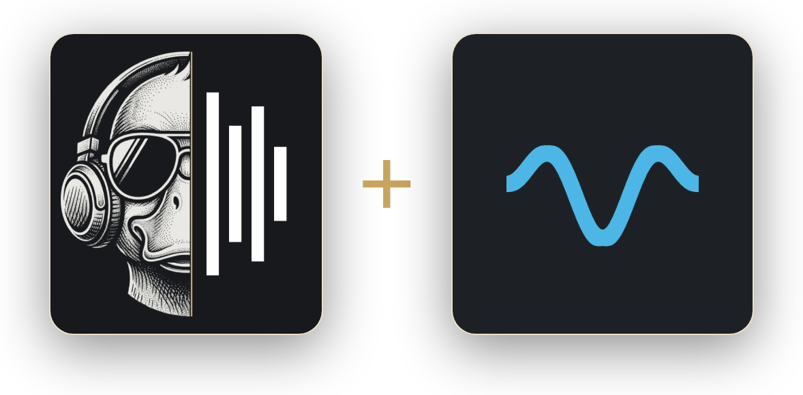

Rouen + <a href="https://github.com/statelycurmudgeon/hqpweb">hqpweb</a> (logo © statelycurmudgeon, MIT)

## Rouen + HQPWeb — v2.0.8 - Profiles shared with Roon; Smart Picks with no sign-in

A music-discovery companion, remote and wall display for [Roon](https://roon.app), with
[hqpweb](https://github.com/statelycurmudgeon/hqpweb) built in for HQPlayer. New in v2.0: **Rouen for
Android**, which makes your phone a Roon zone at home and away from home, with all the music still coming through
Roon.

**📖 Everything is on the guide: https://meltface-80.github.io/Rouen**

- [Features](https://meltface-80.github.io/Rouen/features.html)
- [Install with Docker](https://meltface-80.github.io/Rouen/install.html) (Linux, a NAS, macOS) ·
  [Windows](https://meltface-80.github.io/Rouen/windows.html) · [Unraid](https://meltface-80.github.io/Rouen/unraid.html)
- [Rouen for Android](https://meltface-80.github.io/Rouen/android.html): setting it up, using it, what it doesn't do, and
  why the music might drop out
- [Rouen + HQPWeb](https://meltface-80.github.io/Rouen/hqpweb.html): HQPlayer control, from statelycurmudgeon's hqpweb,
  with thanks, under its MIT licence
- [Uninstall](https://meltface-80.github.io/Rouen/uninstall.html)

⬇ **[Download Rouen for Android](https://github.com/meltface-80/Rouen/releases/latest/download/rouen-android.apk)**:
makes your phone a Roon zone, with Rouen on your server or PC.

The Windows file and the Android app are also on the [latest release](https://github.com/meltface-80/Rouen/releases/latest).
What changed in each version is in [CHANGELOG.md](CHANGELOG.md).
